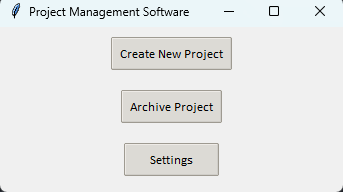
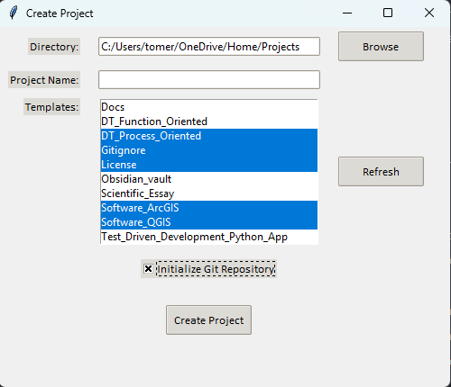
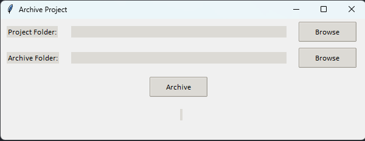

# Project Management Software

## Info

Author: Tomer Peled (Tomer.a.peled@gmail.com)
Date: 04/09/2025

This project aims to create a program that acts as a project manager for my personal projects.

## Screenshots

## Functions

### New project creation

- Create a new project from chosen template folders.
- All chosen template folders will be copied into the new project folder.
- Template folder: Contains folders and files.
- Any text 'PROJECT_NAME', either in a file/folder name or file content, will be replaced with the user given project name.
- Any text 'CURRENT_DATE', either in a file/folder name or file content, will be replaced with the current date.
- Option to create an empty git repository in the project folder

### Project management

- Allows user to archive projects, which zips the project and moves it to the archive.

## How to use

Windows: Download the latest release, run the .exe, done!
Mac & Linux: Not tested. Might be able to compile the code yourself.

## Template folders

See the template folders dir for examples on how to make a template folder.
All selected template folders will be copy-pasted into the project.
Any text 'PROJECT_NAME', either in a file/folder name or file content, will be replaced with the user given project name.
